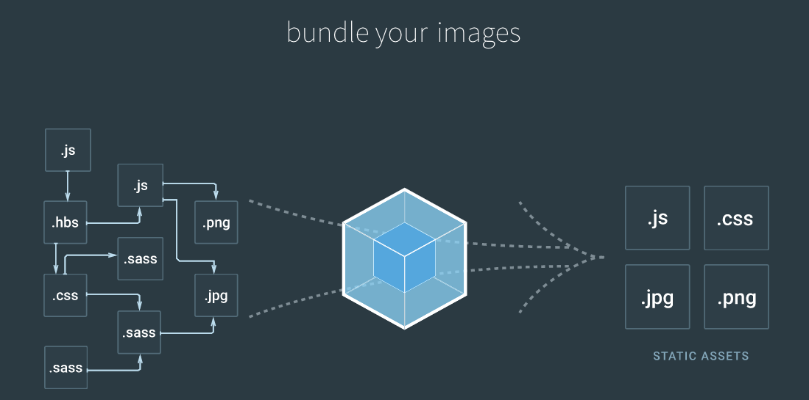

## Webpack是什么？



从上面的图来看，可以理解，Webpack是方便我们将不同的**模块**进行打包，最后集成在一起

### 模块

模块，在webpack中，官方的解释是：

> webpack treats every file \(.css, .html, .scss, .jpg, etc.\) as a module
>
> webpack 将每一个文件都当作一个模块，无论是css，html，scss，还是jpg文件

## Webpack 的配置

官网 Demo：[Getting Start](https://webpack.js.org/guides/getting-started/)

这里就不再赘述如何配置了，主要提一下需要注意的点

### webpack 的 config

webpack 默认的congfig 是 `webpack.config.js`

但是我们可以通过命令行 `--config` 对默认的 config 进行修改

```
webpack --config my.config.js
```

### 配置文件

必须在 `webpack.config.js` 中指定

```js
{
    /* webpack的入口文件 */
    entry: '...',

    /* webpack 的输出文件*/
    output: {
        filename: '...',
        //指定文件路径，resolve 会将 __dirname 和路径 'dist' 进行拼接
        path: path.resolve(__dirname, 'dist')
    }
}
```


